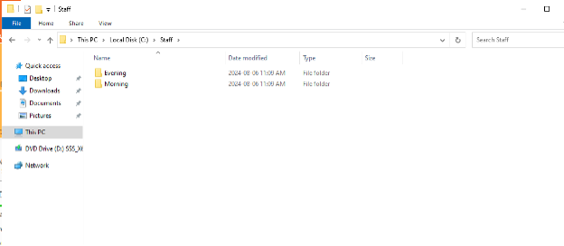

# Comprehensive Setup and Security Audit of Windows Server 2022: ADDS, DHCP, WDS, and More

## Introduction

### Purpose

The purpose of this project is to deploy and configure a Windows Server 2022 environment, focusing on implementing essential services such as Active Directory Domain Services (ADDS), Dynamic Host Configuration Protocol (DHCP), and Windows Deployment Services (WDS). Additionally, the project emphasizes security best practices, including conducting a security audit to ensure a secure and efficient network environment.

### Scope

This project covers the installation and configuration of Windows Server 2022, setting up Active Directory, configuring DHCP, implementing WDS for network-based installations, and ensuring compliance with security protocols. The project also includes a detailed security audit to assess the configuration and user permissions.

## Project Requirements

### Hardware Requirements

- **RAM**: 2-4 GB
- **Storage**: 40-60 GB
- **Network Adapter**: LAN-Segment #1

### Software Requirements

- **Operating System**: Windows Server 2022
- **Tools**: PowerShell, Active Directory Users and Computers, DHCP Management Console, WDS Management Console

## Installation Steps

### Installing Windows Server 2022

1. Boot from the Windows Server 2022 installation media.
2. Select the desired installation language, time, and keyboard preferences.
3. Click "Install Now" and choose the appropriate edition of Windows Server 2022.
4. Accept the license terms and select "Custom: Install Windows only (advanced)."
5. Allocate 40-60 GB of storage and configure 2-4 GB of RAM as needed.
6. Set the network adapter to LAN-Segment #1 and complete the installation.

### Configuring Active Directory

1. Open **Server Manager**.
2. Click on **Add roles and features**.
3. Select **Active Directory Domain Services** and complete the installation.
4. After installation, promote the server to a domain controller:
   - Create a new forest with the domain name `emmanuel.ca`.
5. Create an Organizational Unit (OU) named **Toronto**.

### User and Group Management

1. Within the **Toronto** OU, create the following groups:
   - **AMG**
   - **PMG**
2. Create the following users within the **Toronto** OU:
   - `yourfirstname`
   - `AMSTD1`
   - `AMSTD2`
   - `AMSTD3`
   - `PMSTD1`
   - `PMSTD2`
3. Assign users to their respective groups:
   - Add `yourfirstname`, `AMSTD1`, `AMSTD2`, and `AMSTD3` to **AMG**.
   - Add `PMSTD1` and `PMSTD2` to **PMG**.

### Security Configurations

1. **Create Staff Folder**: On local disk `C:\`, create a folder named **Staff**.
   - Within **Staff**, create two subfolders: **Morning** and **Evening**.
2. **Implement Principle of Least Privilege**:
   - Set permissions:
     - **AMG**: Full Control in **Morning** folder.
     - **PMG**: Deny access in **Morning** folder and Full Control in **Evening** folder.
3. **User Restrictions**:
   - **AMSTD1**: Work hours restricted to M-F, 09:00-16:00.
   - **AMSTD2**: Login restricted to Computer PC05.
   - **AMSTD3**: Account set to expire on 20th March 2024.
   - **PMSTD1**: User account disabled.
4. **Enable Access-Based Enumeration**: Configure access-based enumeration for folder visibility.

## Network Configuration

### DHCP Installation

1. Open **Server Manager** and navigate to **Add roles and features**.
2. Install the **DHCP Server** role.
3. Create a new DHCP scope named **VLAN1** with the following settings:
   - **IP Range**: 192.168.1.1 - 192.168.1.254
   - **Lease Time**: 1 hour.

### WDS Installation

1. Open **Server Manager** and add the **Windows Deployment Services** role.
2. Configure WDS and create a new install group named **Win10**.
3. Add **install.wim** and **boot.wim** to the respective groups.
4. Test the network-based installation of Windows 10.

## Web Services Setup

### IIS Installation

1. Install **Internet Information Services (IIS)** via Server Manager.
2. Create a new website named **study** with the URL `study.yourfirstname.ca`.
3. Ensure the website displays your name, student ID, and the module you study.
4. Set up an FTP server and create a shared folder named **FTPCompany**. Add random files to it.
5. Test FTP access by navigating to `FTP://study.yourfirstname.ca`.

## VPN and NAT Setup

1. Add a second network adapter and configure it as **Private** with a static IP of 192.168.1.200.
2. Rename the existing adapter to **Public**.
3. Create a new NAT server linking Public and Private networks.
4. Enable Routing and Remote Access to allow VPN connectivity.
5. Test internet access from the deployed Windows 10 machines.

## RAID Configuration

1. Add seven 1 GB disks to the system.
2. Create the following RAID configurations:
   - **RAID 0**: Striping for performance.
   - **RAID 1**: Mirroring for redundancy.
   - **RAID 5**: Striping with parity for balanced performance and redundancy.

## Security Audit

### Conducting the Security Audit

1. Review user accounts and permissions within Active Directory.
2. Verify group memberships and access controls for folders.
3. Assess DHCP configurations for proper range and lease settings.
4. Document findings and make recommendations for improvements.

## Screenshots

_(Add your screenshots here, with descriptions as needed.)_

1. **Installation of Windows Server 2022**:

   - 

2. **Active Directory Configuration & User and Group Management & Security Configurations**:

   - 
   - 
   - 
   - 
   - 
   - 
   - 
   - 
   - 
   - 
   - 
   - 
   - 
   - 
   - 
   - 

3. **DHCP Configuration**:

   - 
   - 
   - 

4. **WDS Installation**:

   - 
   - 
   - 
   - 
   - 

5. **IIS Setup**:

   - 
   - 
   - 

6. **VPN and NAT Setup**:

   - 
   - 
   - 
   - 
   - 

7. **RAID Configuration**:
   - 
   - 
   - 
   - 

## Conclusion

This project successfully demonstrates the deployment and configuration of Windows Server 2022, highlighting key services such as ADDS, DHCP, and WDS. The integration of security audits reinforces the importance of maintaining a secure network environment, ensuring user permissions are appropriately managed. The project emphasizes the significance of implementing the principle of least privilege to minimize security risks.
