# Project: Microsoft Network Infrastructure and Cloud Technologies Configuration

# Objective:

This project involves setting up and configuring **Microsoft network infrastructure and
cloud technologies** using **Windows Server 2022** , Azure AD (Entra ID), and Office 365. The
goal is to demonstrate proficiency in **Active Directory (AD), Azure integration, security
policies, and collaboration tools**.

**Phase 1: Active Directory Setup on Windows Server 2022
Overview**

- **Installed Windows Server 2022** and promoted it to a **Domain Controller**.
- Configured the domain **emmanuel.ca**.
- Set up **Organizational Units (OUs)** to effectively organize users.
- Created **On-Premises Users** and assigned them to the appropriate OUs.

**PowerShell Scripts**
I created two PowerShell scripts to automate this:

1. **Script for Installing Active Directory Domain Services (AD DS):** This script installs
   the necessary components and promotes the server to a Domain Controller.
2. **Script for Creating OUs and Users:** This script sets up the OUs and creates users,
   organizing them according to their respective teams.

   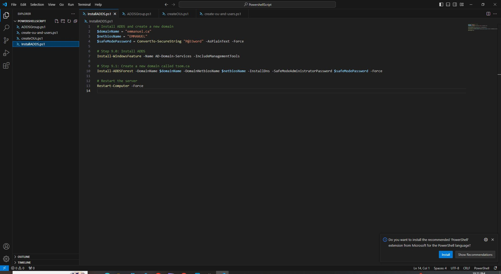
   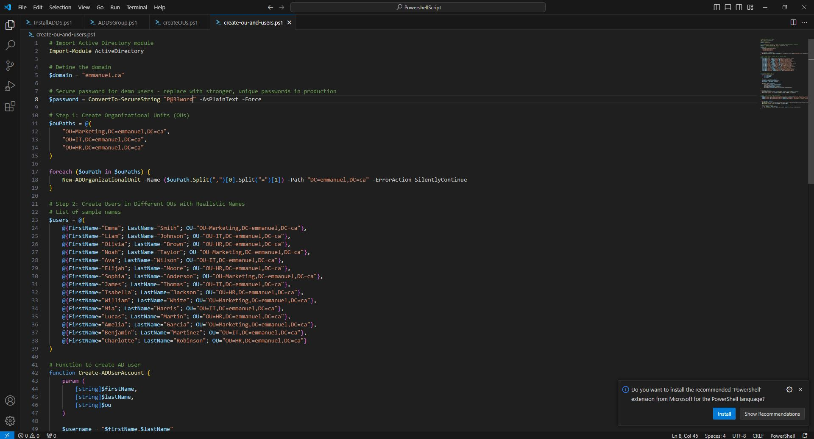
   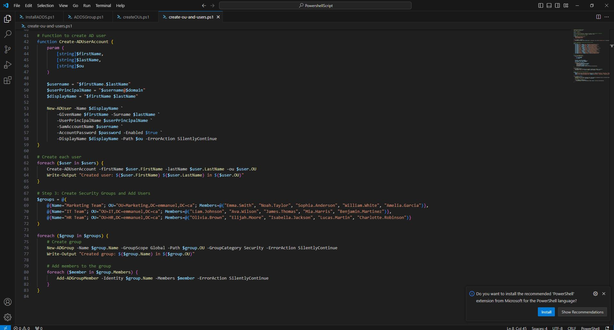
   

**Phase 2: Azure AD Integration with On-Premises AD
Objective:**
Set up **Azure AD (Entra ID)** and synchronize it with on-prem AD using **Azure AD Connect** to
enable **SSO** and central identity management.
**Steps:**

1. Created an **Azure AD tenant** and connected it to the on-premises domain.
2. Installed and configured **Azure AD Connect** to sync users from emmanuel.ca.

3. Enabled **Single Sign-On (SSO)** for Office 365.
4. Configured **Multi-Factor Authentication (MFA)** for IT Admins and Finance Team
   users.

**Entra ID Users and Groups:**
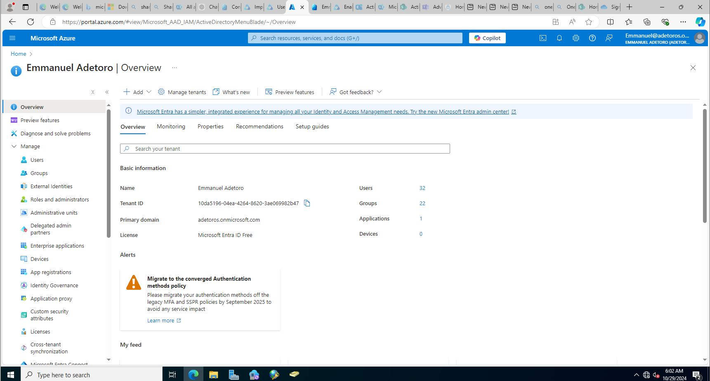
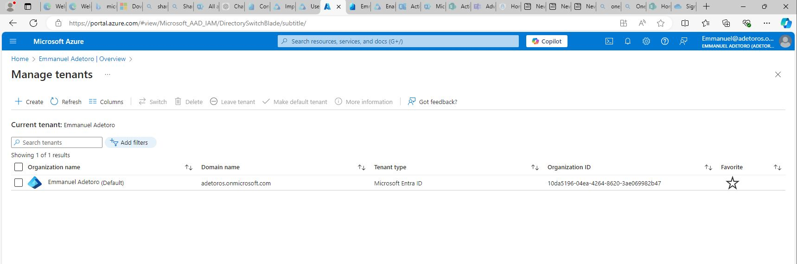
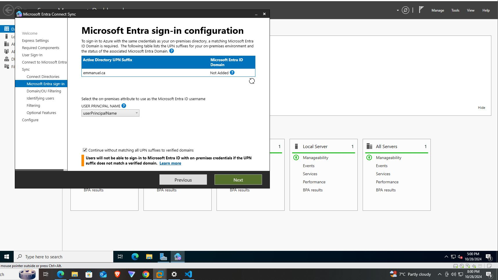
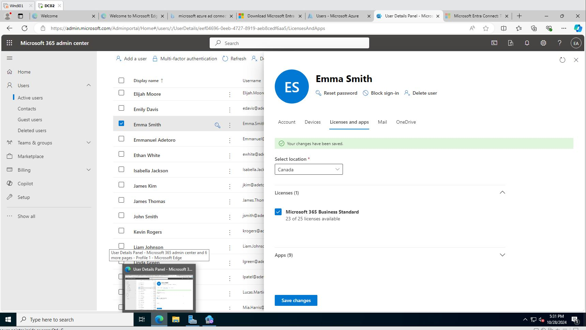
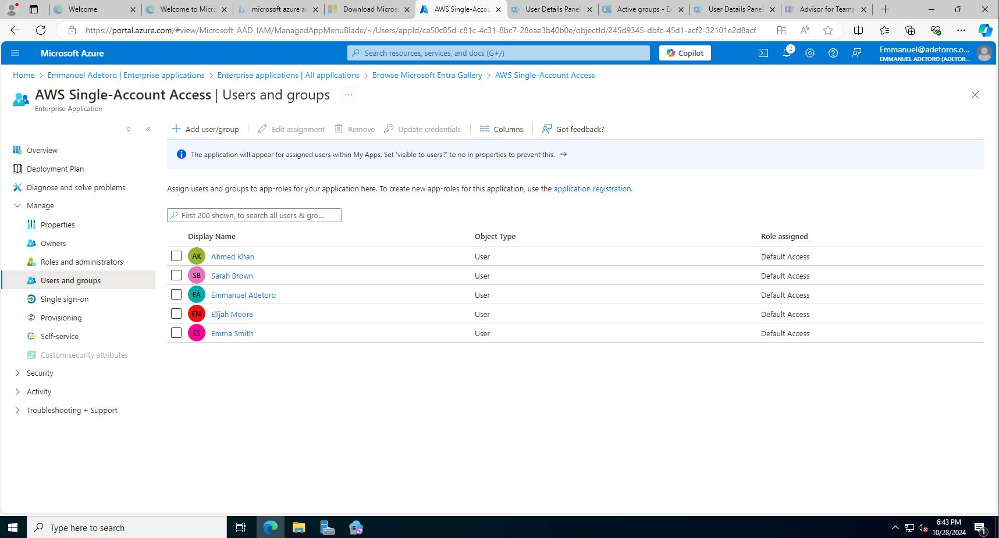
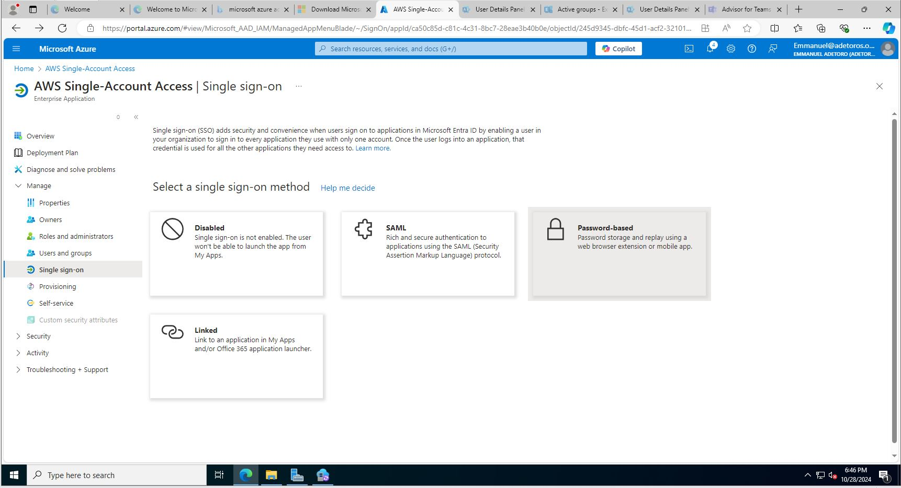
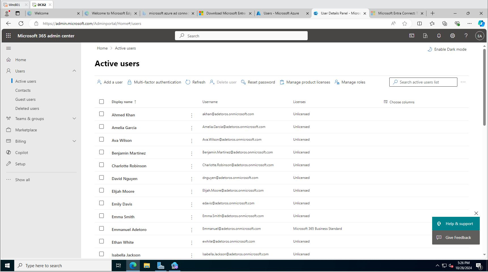
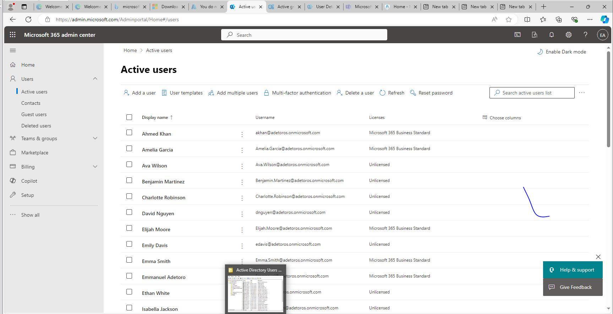
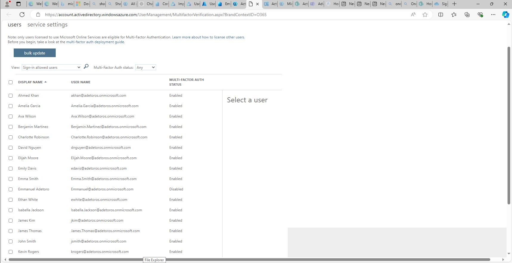

**Phase 3: Group Policies and NPS Configuration
Objective:**
Configure **Group Policy Objects (GPOs)** and **Network Policy Server (NPS)** for secure
access.
**Steps:**

1. Created **GPOs** to enforce password policies and limit access to sensitive areas.
2. Configured **NPS policies** to allow **VPN access** only to the IT Admins and Helpdesk
   users.
3. Tested VPN connectivity with a Helpdesk user.

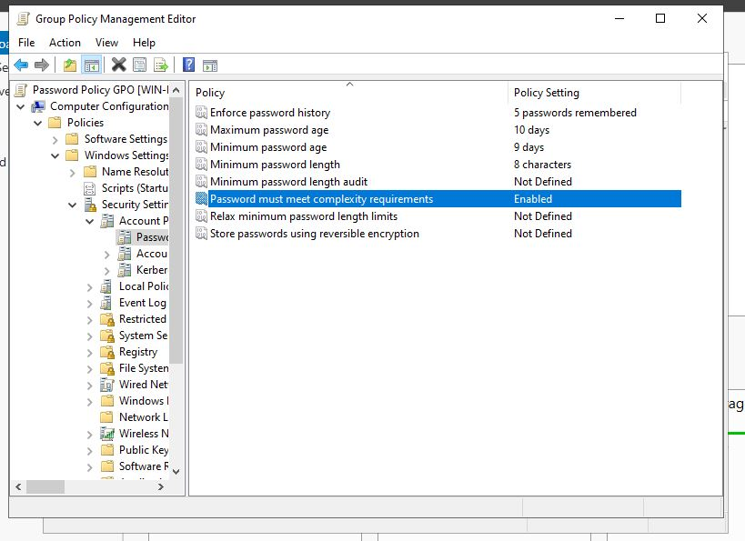
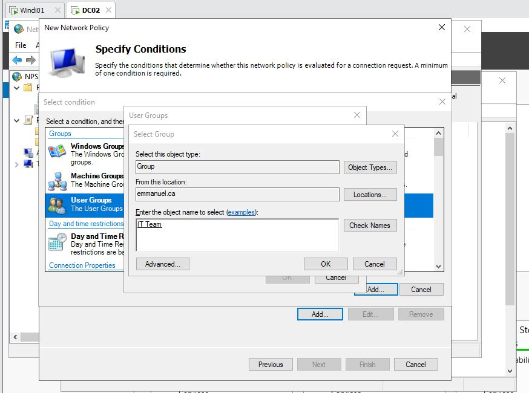

**Phase 4: Office 365 Configuration for Collaboration
Objective:**
Set up **Office 365** and ensure smooth collaboration between users and teams.
**Steps:**

1. Assigned Office 365 licenses to users synced from Azure AD.
2. Created a **SharePoint Team Site** for the Marketing Team.
3. Configured **email forwarding restrictions** to prevent data leaks.
4. Enabled **OneDrive for Business** for file sharing across teams.

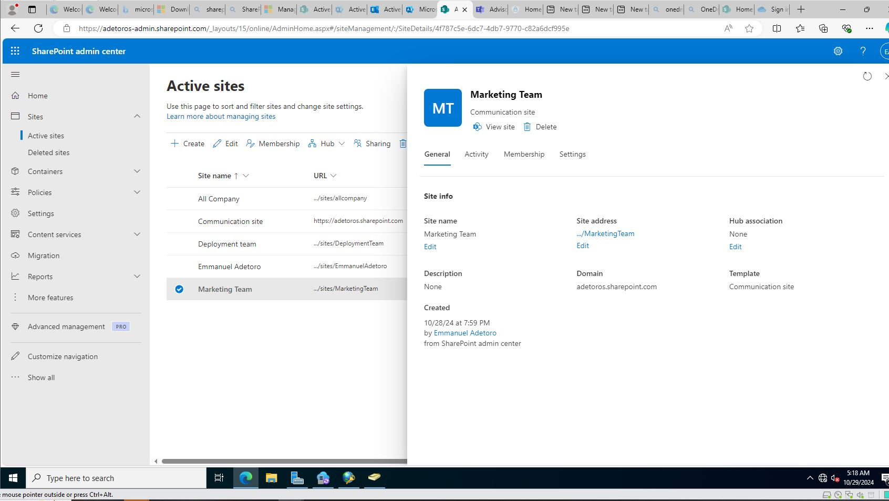

**Phase 5: Monitoring and Compliance Setup
Objective:**
Enable **monitoring and alerts** to track user activities and ensure compliance.
**Steps:**

1. Enabled **Audit Logs and Sign-In Logs** in Azure AD.
2. Configured alerts for **risky sign-ins** and **failed login attempts**.
3. Created a **Data Loss Prevention (DLP) policy** to secure sensitive information.
4. Generated a compliance report for management review.

**Challenges and Workarounds**

- Some advanced features required **premium licenses** (e.g., conditional access,
  compliance e.t.c).
- Workaround: Demonstrated basic setups and simulated workflows for the
  unavailable features.

  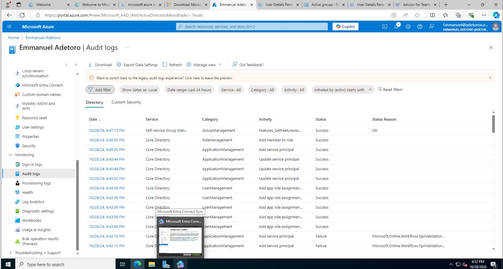
  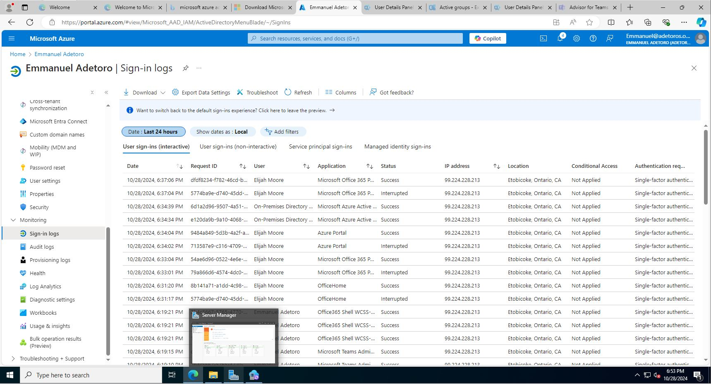
  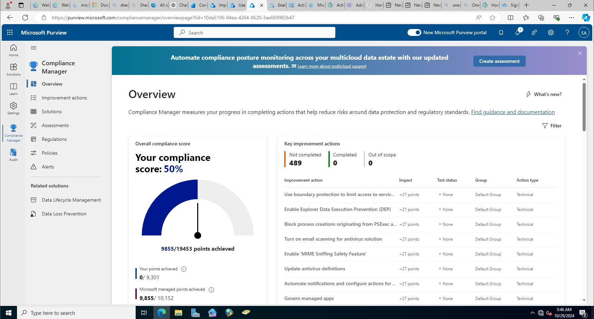

**Summary of Accomplishments**

- Set up **Windows Server 2022** as a domain controller for **Active Directory**.
- Integrated **Azure AD** with the on-prem domain for **SSO**.
- Configured **GPOs, NPS policies** , and VPN access.
- Managed **Office 365** services for collaboration and secured user access with **MFA**.
- Implemented **audit logs, alerts** , and **DLP policies** for security monitoring and
  compliance.

**Conclusion**
This project demonstrates a comprehensive setup of **Microsoft network infrastructure
and cloud technologies** using **Windows Server 2022, Azure AD, and Office 365**. It
reflects my ability to manage user identities, enforce security policies, and enable
collaboration across platforms.
