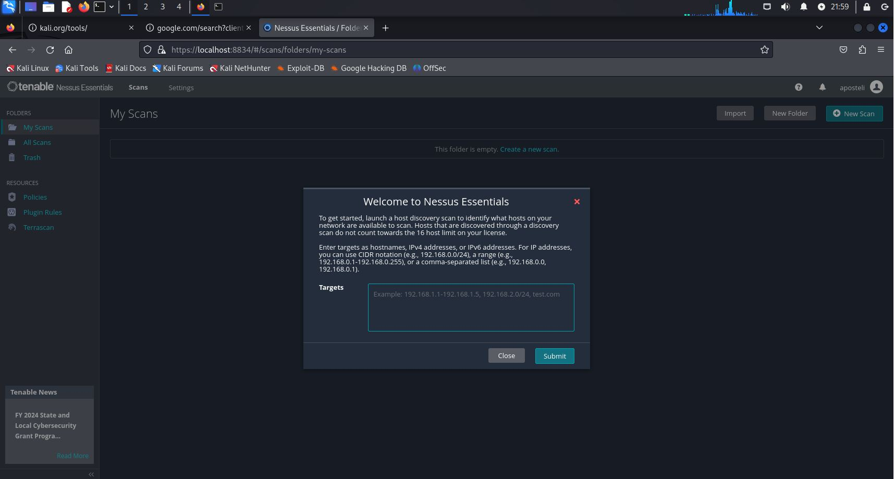

# Vulnerability Scanning Project Using Nessus: Work Sample

## Project Overview
This project demonstrates a complete vulnerability assessment and remediation process in a virtualized environment. Using Nessus on Kali Linux, I scanned a Windows 10 virtual machine for vulnerabilities, analyzed the results, and applied necessary remediations to enhance the system's security posture.

### Tools Used:
- **VMware Workstation Player**: For creating and managing virtual machines.
- **Nessus Essentials**: To conduct vulnerability assessments.
- **Windows 10**: The target system for vulnerability scanning.

---

## Environment Setup
1. **Creating Virtual Machines**:
   - Deployed two VMs within VMware: Kali Linux (Nessus scanner) and Windows 10 (target system).
   - Allocated the Windows 10 VM with 4 GB RAM, 4 processors, and 50 GB storage.

   

2. **Nessus Installation**:
   - Installed Nessus Essentials on the Kali Linux VM.
   - Configured Nessus for internal network scanning of the Windows 10 VM.

   

---

## Initial Vulnerability Scan (Non-Credentialed)
- **Scan Type**: Basic Network Scan using Nessus.
- **Results**:
   - Identified various vulnerabilities related to network configurations and security.
   - Some low and medium severity issues were discovered, but visibility into system-level vulnerabilities was limited due to the lack of credentials.

   

## Configuring Credentialed Scans
- Enabled deeper system access by configuring the Windows 10 VM for credentialed scanning:
   - Activated Remote Registry and adjusted User Account Control settings.
   - Modified the Windows registry to allow Local Account Token Filtering, enabling Nessus to perform a comprehensive scan.
   - Input Windows VM credentials into Nessus for privileged access.

   

---

## Second Scan (Credentialed)
- **Results**:
   - Uncovered a wider range of vulnerabilities, including critical system misconfigurations and outdated software components.
   - The credentialed scan revealed higher severity vulnerabilities, such as unpatched Windows services and registry issues.

   

## Introducing Additional Vulnerabilities
- **Action**: Installed an outdated version of Firefox (v3.6.12) on the Windows 10 VM to simulate real-world vulnerability scenarios.
- **Results**: The number of vulnerabilities increased significantly, particularly critical issues related to outdated browser components.

   

---

## Remediation Process
1. **Uninstalling Firefox**: Removed the deprecated version of Firefox, eliminating the browser-related vulnerabilities.
2. **Applying Windows Updates**: Updated the Windows 10 system with the latest security patches, addressing several critical and high-severity vulnerabilities.
3. **Misconfiguration Fixes**: Adjusted system settings, such as enabling security features and correcting registry configurations, to further harden the system.

   

---

## Final Scan After Remediation
- **Outcome**: A follow-up credentialed scan showed no remaining vulnerabilities. The system was now fully patched and secure, demonstrating the effectiveness of the applied remediation measures.

   

---

## Conclusion
This project provided hands-on experience in vulnerability management and system hardening using Nessus. The following key outcomes were achieved:
- Identified critical vulnerabilities in a controlled environment.
- Applied patches and system updates to effectively reduce security risks.
- Successfully transitioned the system from a vulnerable state to a secure posture with no outstanding vulnerabilities.

Through this process, I enhanced my skills in vulnerability assessment, credentialed scanning, and remediation techniques, which are crucial for cybersecurity management.

---

### Skills Gained
- **Vulnerability Scanning**: Proficient in using Nessus to perform both non-credentialed and credentialed scans.
- **System Remediation**: Experience in patch management, uninstalling vulnerable software, and addressing system misconfigurations.
- **Risk Mitigation**: Developed a structured approach to analyzing and reducing vulnerabilities in virtual environments.

### Resources Used
- VMware Workstation Player
- Nessus Essentials
- Windows 10 ISO
